# Heartbeat Measuring Electronic Circuit (Analog Front-End)

This repository documents a hardware project that measures heartbeat signals using a **reflective IR sensor** and an **analog signal-conditioning chain** (filtering + amplification), with a conceptual path toward **BPM counting**.

> **Note:** This is a documentation-only repository (original code/simulation files were not retained). The included report and figures provide the design details and results.

## What I built

- Heartbeat sensing using a reflective IR sensor (CNY70)
- Signal characterization (time-domain + FFT)
- Band-pass filtering around the heartbeat band (example response shown between **0.7–7 Hz**)
- Non-inverting op-amp amplification stage (TL082)
- Conceptual digital counting stage (counter) for BPM

## Contents

- **Report (PDF):** [`docs/Heartbeat_Measuring_Electronic_Circuit.pdf`](docs/Heartbeat_Measuring_Electronic_Circuit.pdf)
- **Figures extracted from the report:** [`images/`](images/)

## Key figures (from the report)

### Figure 1: CNY70 Sensor

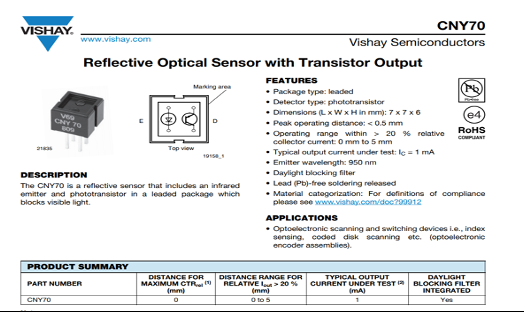

### Figure 1.1: Output voltage of our sensor, with R=100 ohm

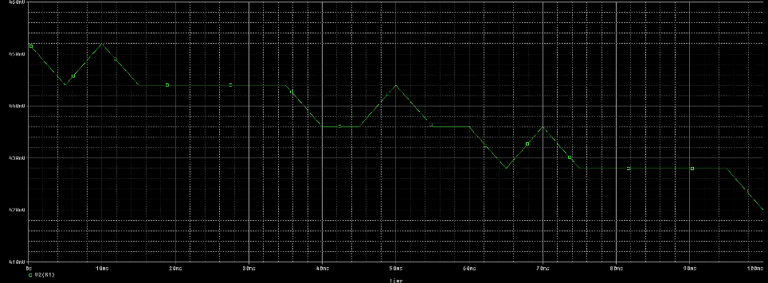

### Figure 1.2: FFT of our signal

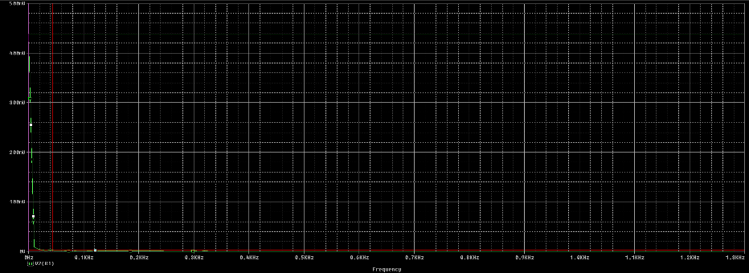

### Figure 1.3: Frequency band of the sensor signal, tending towards 10Hz

### Figure 1.4: Physical sensor and its schematic

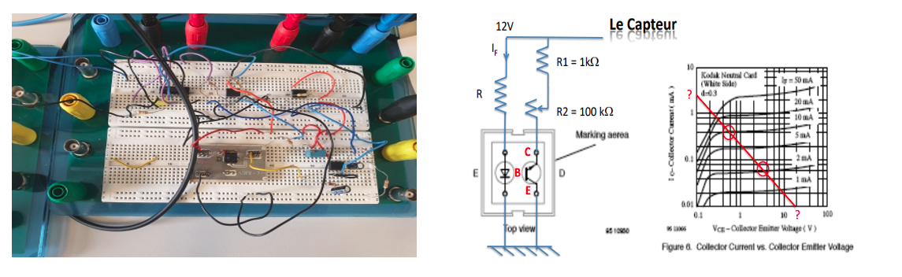

### Figure 1.5: Load line of the phototransistor

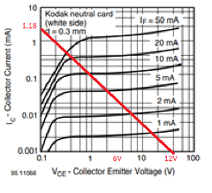

### Figure 1.6: Unfiltered heartbeat signal

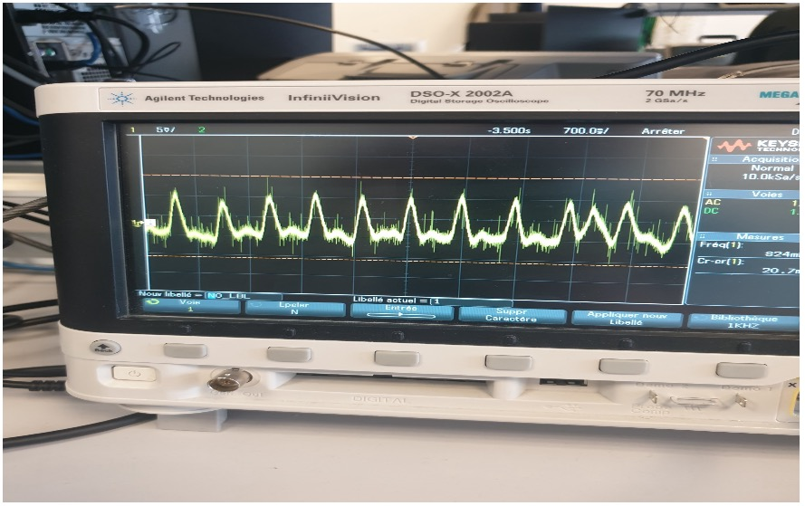

### Figure 2.1: Filter with impedance adaptation

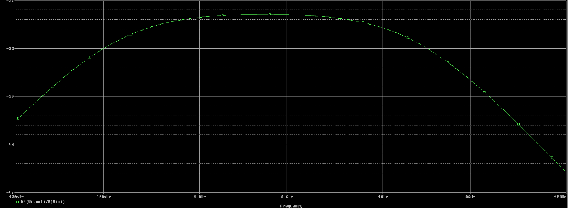

### Figure 2.2: Band-pass filter response between 0.7Hz and 7Hz

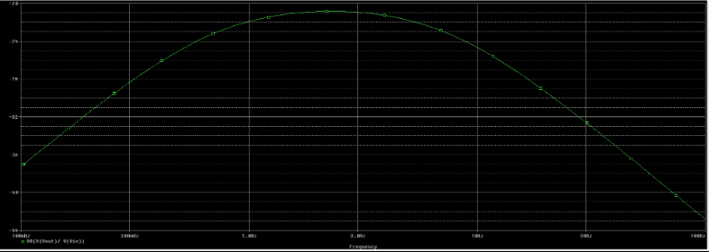

### Figure 2.3: Filter with impedance adaptation, same pass-band

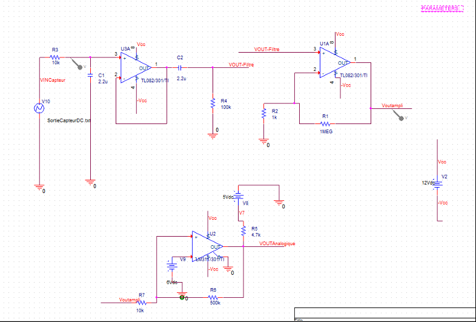

### Figure 2.4: MATLAB simulation of ideal vs. practical band-pass filter

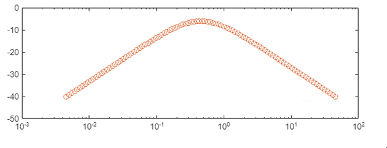

### Figure 2.5: Practical filter implementation and oscilloscope output

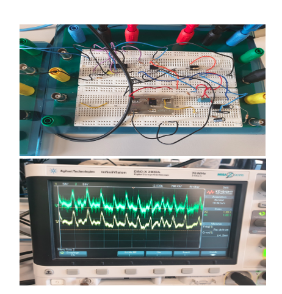

### Figure 3.1: Non-inverting amplifier TL082

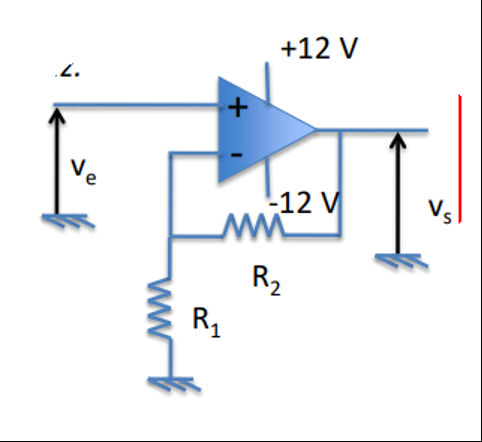

### Figure 3.2: Gain-bandwidth relationship in simulation

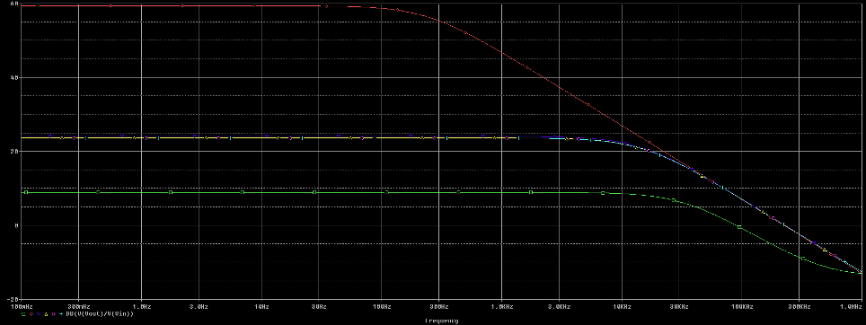

### Figure 3.3: Amplifier implementation in PSpice

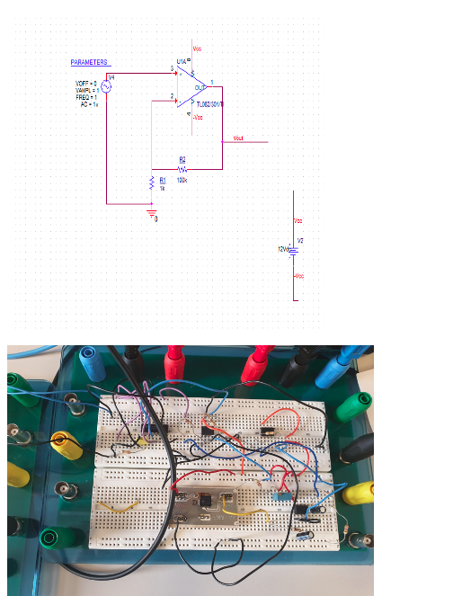

### Figure 3.4: Amplified heartbeat signal on oscilloscope

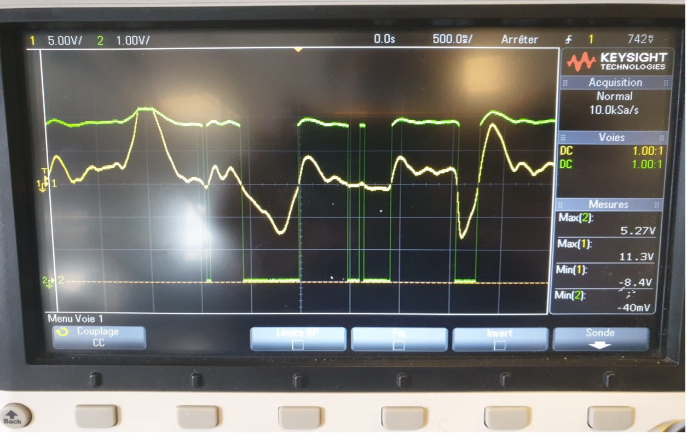

### Figure 4.1: 4-bit counter schematic in PSpice

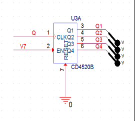

## Disclaimer

This project is for educational purposes only and **not** a medical device.
